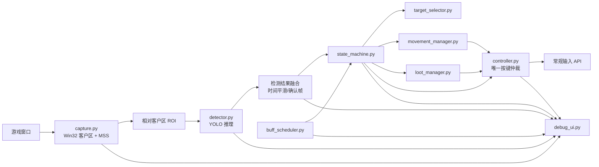
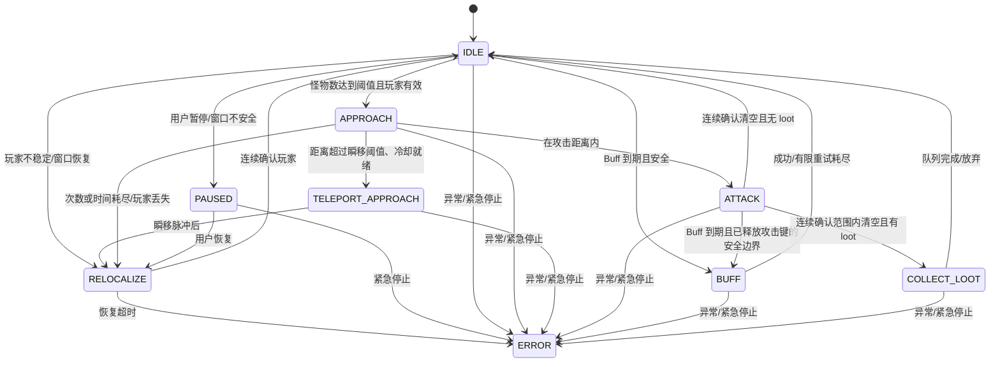

# 系统架构与状态机（Phase 0）

## 1. 已知需求、设计决策与未确认项

|类别|内容|
|---|---|
|已知需求|固定地图/主要同水平平台；窗口通常位于右侧；仅左右、瞬移、攻击、Buff；宠物自动拾取；默认不发键。|
|技术设计|Python 3.11+；`mss` + `pywin32` 采集；Ultralytics YOLO 轻量模型；`PySide6` 调试界面；线程安全快照总线；单一控制器仲裁按键。|
|未确认项|实际窗口标题、DPI 缩放、客户端真实尺寸、ROI、技能键位/施法语义、瞬移冷却和位移、攻击范围、宠物拾取范围、服务条款许可。|

**边界：** 在未确认目标服务条款允许常规输入自动化前，不启用真实输入。不得使用注入、内存访问/修改、反作弊规避或后台绕过焦点限制。

## 2. 模块与数据流



### 模块职责

- `capture.py`：启用进程 DPI awareness；以标题关键词枚举 Win32 窗口，取得**客户区**的屏幕坐标；定期复查最小化、前台、尺寸及坐标。MSS 只采集客户区或其 ROI。ROI 从客户区相对坐标换算，绝不写死屏幕位置。
- `detector.py`：加载配置中的 `.pt`，对 ROI 执行类别过滤/分级置信度阈值，输出 `Detection(class_id, confidence, xyxy, foot_point, timestamp)` 和推理耗时。
- `target_selector.py`：从稳定检测中选择同平台优先、横向距离最近且满足滞回约束的目标；不直接发键。
- `movement_manager.py`：将方向/距离翻译为有限普通移动或方向+瞬移的短动作计划，动作后强制重新检测。
- `state_machine.py`：唯一任务编排者；只消费时间戳有效的视觉快照和调度器请求，输出允许动作。
- `controller.py`：唯一真实输入出口；维护按下集合、资源锁（移动/攻击/瞬移/Buff）、事件日志和 `release_all_keys()`；DRY_RUN 仅记账/显示。
- `buff_scheduler.py`：单调时钟维护“到期待执行”，不 sleep 阻塞主循环；由 FSM 在安全窗口授予施放。
- `loot_manager.py`：维护有限队列、经过、停留、视觉消失确认、超时/重试/放弃的不同状态。
- `debug_ui.py`：仅渲染不可变状态快照和投递用户命令，绝不在 UI 线程执行推理或直接发键。

## 3. 采集、坐标与检测稳定性

1. 每 `WINDOW_CHECK_INTERVAL_S` 重新读取客户区；窗口最小化、尺寸异常或（若配置要求）非前台时，发布 `WINDOW_UNSAFE`，控制器立即释放键并进入暂停。
2. 对 DPI：启动时调用 Windows DPI awareness API；窗口 API 和 MSS 使用同一物理像素坐标系。UI 显示“客户区 screen rect”和“ROI screen rect”，以便核对。
3. ROI 为 `(ROI_X, ROI_Y, ROI_WIDTH, ROI_HEIGHT)`，相对客户区左上角；启动时和每次窗口变动时校验不越界。
4. 玩家落脚点 `((x1+x2)/2, y2)` 比框中心更合适：横版平台的移动/攻击距离主要与脚所在的平台横向位置相关；中心会随跳跃、攻击特效及角色立绘高度改变而偏移。
5. 对每类保存最近带时间戳的结果。玩家连续 `MAX_MISSED_FRAMES` 才失效；怪物“清空”须连续 `ATTACK_CLEAR_CONFIRM_FRAMES` 且仅统计玩家攻击/配置范围内目标；单帧漏检保持上次稳定状态。第一版用指数平滑和时间窗去重，不引入跟踪器。

## 4. FSM



### 状态契约

|状态|进入/执行|退出/超时|允许按键|
|---|---|---|---|
|IDLE|安全检查、目标确认、等待 Buff|目标稳定后接近；窗口问题暂停|无|
|RELOCALIZE|释放所有键，连续采集确认玩家|确认后 IDLE；超时 ERROR|无|
|APPROACH|选目标；距离有滞回的短方向脉冲；每次后复检|进入攻击距离→ATTACK；尝试/时间耗尽→RELOCALIZE|仅一个方向键|
|TELEPORT_APPROACH|释放移动，方向短按再瞬移短按；记录冷却|等待稳定→RELOCALIZE；次数耗尽→APPROACH|方向与瞬移序列，禁止攻击/Buff|
|ATTACK|先释放移动/瞬移，稳定延迟后攻击；连续检测|确认清空→loot/IDLE；最大时长→RELOCALIZE|仅攻击|
|BUFF|控制器先释放冲突键，施法/延迟、有限重试|成功或重试耗尽→IDLE（失败日志）|仅 Buff|
|COLLECT_LOOT|有限队列逐个接近、经过、停留，观察消失|完成/放弃→IDLE；丢失→RELOCALIZE|仅必要的短方向移动|
|PAUSED/ERROR|立即释放键，不保留旧动作|恢复只能经 RELOCALIZE；ERROR 需人工重新启动|无|

禁止 `APPROACH↔ATTACK` 因单帧距离波动来回切换：使用攻击进入/退出不同阈值、最短状态停留时间和确认帧。禁止任何状态直接“恢复”到旧动作；紧急停止优先级最高，控制器同步释放全部键。

## 5. 协调规则

- **目标优先级：** 紧急停止/窗口不安全 > ERROR/PAUSED > 当前不可中断短按的安全收尾 > 玩家重定位 > 到期 Buff > 攻击/接近 > 掉落物。Buff 可配置为只在 IDLE、攻击周期边界或收尾时执行，绝不与瞬移并发。
- **移动策略：** 目标在左/右，分别仅短按左/右。距离在攻击距离内不移动；在滞回带内保持 IDLE/攻击，防止左右横跳。普通移动优先于近距离及未知瞬移落点情形；只有距离超过经实测的瞬移阈值、冷却就绪、连续次数未满时才使用瞬移。瞬移后不假定落点，必须释放键、等待稳定并 RELOCALIZE。
- **攻击与清怪：** 进入前释放左右/瞬移并等待；攻击由短保持片段组成，片段之间复检。不可用单帧“无怪”退出，须连续确认。超时不盲打，转重定位/安全停机。
- **掉落物：** 检测到、正在经过、视觉已消失、拾取已确认、无法确认是不同状态。“视觉消失”只能是拾取的代理信号，也可能是漏检/消失特效；超时后有限重试并标记放弃。

长按方向或连续瞬移是开环控制：窗口帧率、技能冷却、碰撞、网络延迟、动画和漏检均会使预计位移偏离实际，容易越过目标或失控。因此每个动作必须是有上限的脉冲并重新观测。

## 6. 调试 UI 设计

选择 **PySide6**，因为需要按钮、表格、日志、状态区和可扩展的多面板布局；OpenCV HighGUI 可作为 Phase 1 的最小预览备选，但不适合作为最终复杂控制台。

```text
┌──────────────────────────实时画面（叠加 ROI/框/目标/箭头/路径）──────────────────────────┬────系统状态────┐
│ 图例: player=绿, monster=红, loot=黄；显示置信度、脚点、距离、推理时间                  │ FSM/任务/原因   │
│                                                                                          ├────按键状态────┤
│                                                                                          │ UP/DOWN/时长    │
├──────────────────────────────────────────────────────────────────────────────────────────┼────Buff 监控────┤
│ 掉落物队列表：检测/经过/消失/确认/未确认/放弃；目标、重试、验证结果                       ├────性能监控────┤
├────────────────────────────────────────────日志（清空｜暂停滚动｜保存）───────────────────┼ capture/FPS/GPU │
├ Start | Pause | Resume | Stop | Emergency Stop | DRY_RUN | Overlay | 截图 | 配置 | 日志 ──┴────────────────┤
└──────────────────────────────────────────────────────────────────────────────────────────────────────────┘
```

- 后台采集/检测/控制工作线程各自产生不可变 `SystemSnapshot`，经有界 `queue.Queue(maxsize=1)`（只保留最新帧）交给 UI；UI `QTimer` 约 10–20 Hz 拉取并绘制，避免积压。YOLO 只能在检测线程运行。
- 状态区显示状态、子状态、目标、方向、决策原因、最后切换；按键区显示按下集合、按下时长、最后事件、DRY_RUN；性能区显示采集/推理/FSM/控制耗时、FPS、设备、模型、帧数、漏检数。
- 警告最少包括：窗口未找到、最小化、焦点缺失、客户区异常、ROI 越界、模型载入失败、连续玩家漏检、检测过期、动作超时、Buff 重试耗尽、loot 放弃、急停。每个警告须包含时间、原因和采取的安全动作。
- 标定：先只开 Overlay/DRY_RUN，观察脚点与目标距离；逐步调整 ROI 和检测阈值，再以单次短脉冲日志标定移动距离、单次瞬移结果和攻击范围。不可在未验证前开启真实输入。
